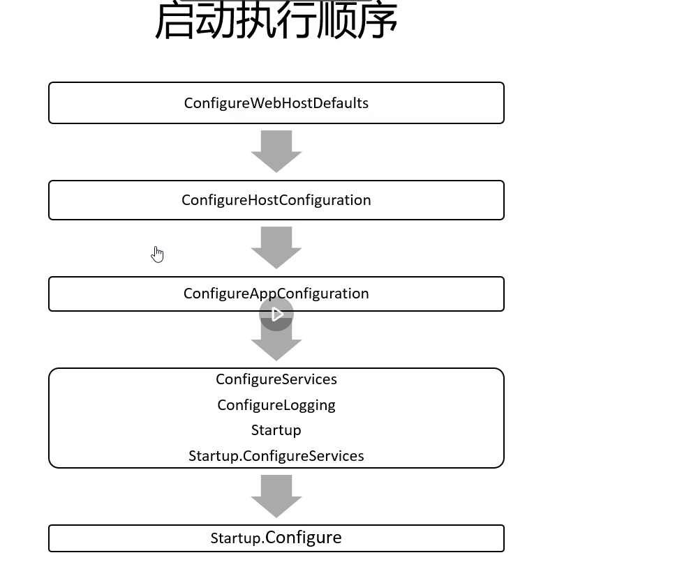

Top to bottom 

ConfigureHostConfiguration  -> 用于监听URL

ConfigureAppConfiguration -> 用于嵌入自己配置文件, 程序各个组件后续读取

ConfigureServices -> 用于注入自己应用的组件

Configure -> 注册中间件， 管理整个HTTPContext

.Net Core 自带DI框架

IServiceCollection   -> 负责注册服务
ServiceDescriptor  -> 注册服务时的信息
IServiceProvider -> 具体的容器， 由 ServiceCollection build 而成
IServiceScope -> 一个容器的子容器的生命周期

避免在根容器获取实现了IDisposable 接口的瞬时对象
避免手动创建实现了IDisposable对象, 应该使用容器来管理奇生命周期

.NET Core 第三方DI 服务 核心扩展点
public interface IserviceProviderFactory<TContainerBuilder>

